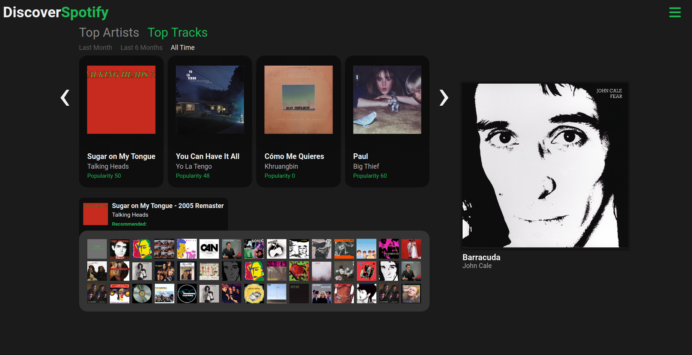

# Spotify Discovery
Spotify Discovery helps you discover new songs and artists similar to the ones you already love.  The application was built using React and Redux on the client-side for building the user interface and handling state management.  The back-end was build using Express and the Spotify API for serving data from Spotify.


## Setup
Before getting started, ensure that you have Node.js installed on your machine. You'll also need a Spotify account in order to use the app.

To run the app, you'll need to create an `.env` file and fill in the variables found inside `example.env`.  You must register an application via Spotify's developer portal to obtain a CLIENT_ID and CLIENT_SECRET.  You'll also need to set a redirect uri within the portal.  More than likely, your `.env` file may look something like this:

```
CLIENT_ID=<CLIENT_ID>
CLIENT_SECRET=<CLIENT_SECRET>
REDIRECT_URI=http://localhost:3000/callback

HOST=http://localhost
PORT=3000

CLIENT_HOME_URL=http://localhost:3000/
```

## Usage
Once you have the app up and running, you can log in using your Spotify credentials. After logging in, you'll be able to see your top tracks and artists from the past 1, 6, or 12 months. Simply hover over a track to listen to a preview, or click on a track or artist to get recommendations for new music.


You can also access a settings menu by clicking on the hamburger icon in the top right corner of the screen. From here, you can disable the play preview on hover feature.